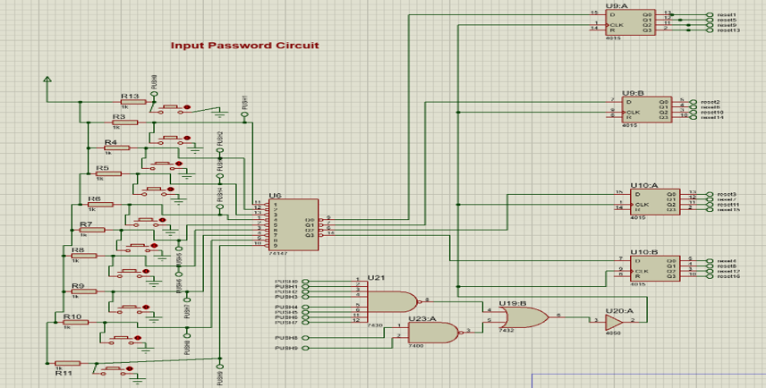
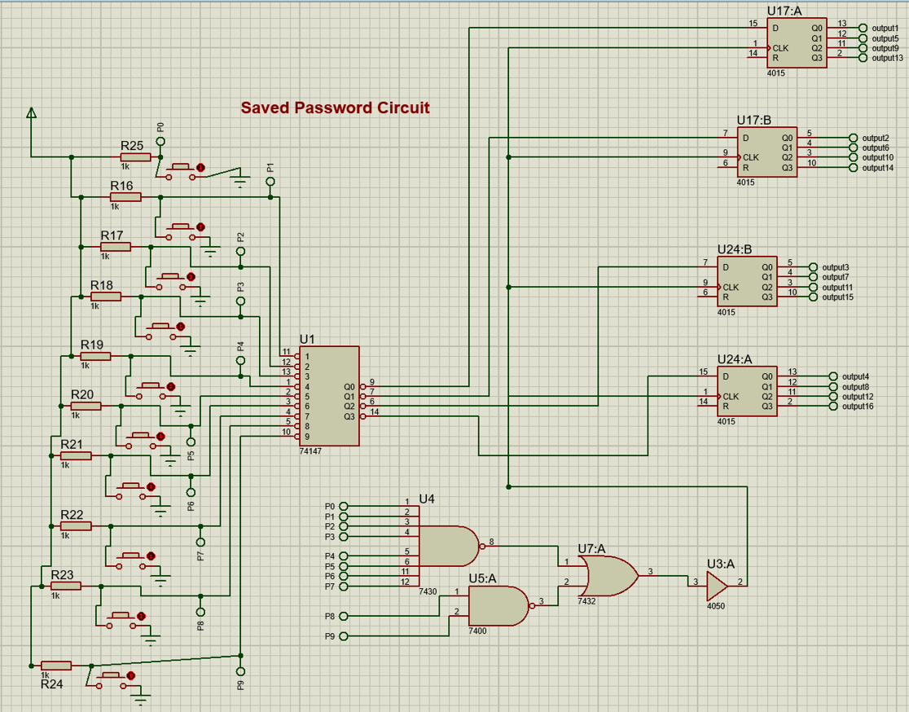
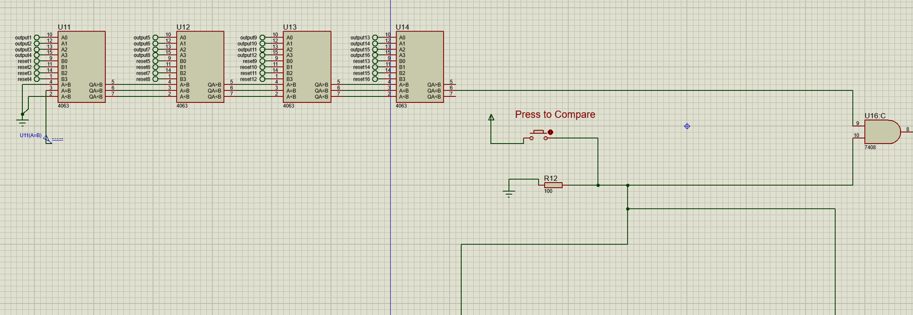
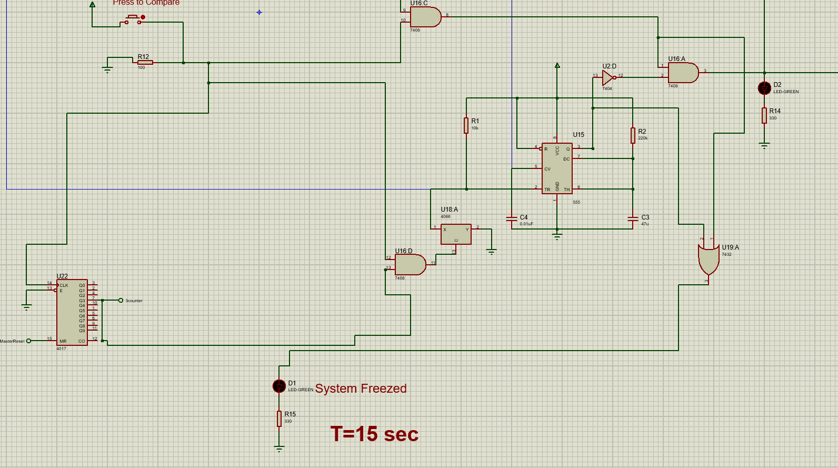
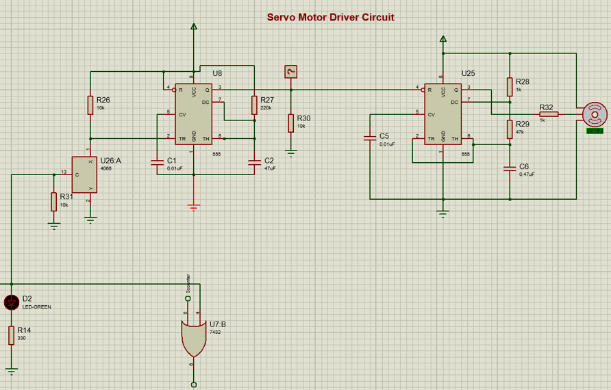
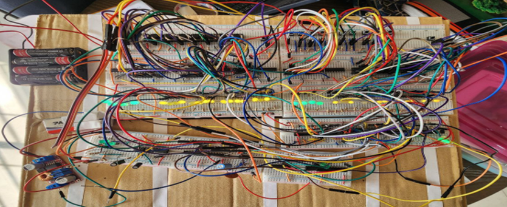

# Digital Logic Circuitry Based Smart Room Security System

**Course:** EEE 304 - Digital Electronics Laboratory  
**Domains:** Digital Logic Design, Sequential/Combinational Circuits, Hardware Prototyping  

## Project Overview
This project presents a novel, password-based door locking system built entirely using fundamental digital logic ICs and gates, eliminating the need for a microcontroller. By relying purely on combinational and sequential logic, the system ensures minimal power consumption, faster response times, and immunity against software vulnerabilities. The design features an indoor preset mechanism for password configuration and an outdoor input terminal for secure access.

## Key Features & Capabilities
* **Pure Digital Logic Control:** Utilizes standard 74-series and 40-series ICs (Encoders, Shift Registers, Comparators) to process password inputs and execute locking mechanisms without programmable boards.
* **Anti-Brute Force Freeze Mechanism:** Integrates a 4017 Johnson Counter and 555 Timer circuit to track incorrect attempts. If an incorrect password is entered three consecutive times, the system completely freezes for 15 seconds.
* **Custom Configurable Password:** Allows authorized users to preset a 4-digit binary password from the indoor block.
* **Servo Motor Integration:** Successfully drives an SG90 servo motor acting as the physical door latch, controlled via custom PWM signals generated by 555 timers in Astable and Monostable modes.

## Hardware & Component Stack
The complete hardware prototype was built on breadboards with a budget of approximately 6,020 BDT.
* **Logic Gates:** 7408 (AND), 7432 (OR), 7404 (NOT), 7400 & 7430 (NAND)
* **Encoders & Registers:** 74147 (9-to-4 Priority Encoder), 4015 (4-bit S/P Shift Register)
* **Comparators & Counters:** 4063 (4-bit Magnitude Comparator), 4017 (Johnson Counter)
* **Actuation:** SG90 Servo Motor, 555 Timers, 4066 (Bilateral Switch)

## System Architecture & Circuit Modules

The system is compartmentalized into specific analog and digital logic blocks to handle user input, validation, and physical actuation.

### 1. Password Input & Storage
The system is divided into two primary input stages: one for the authorized user to set the password inside the room, and one for entering the password outside.

**Input Password Circuit (Outdoor):**

*Figure: Encodes mechanical pushbutton presses into binary for comparison.*

**Saved Password Circuit (Indoor):**

*Figure: Allows the authorized user to preset the correct 4-digit lock combination.*

### 2. Logic & Control Systems
Once the inputs are registered via shift registers, they are compared. If the attempts fail consecutively, the system locks out further attempts to prevent brute-forcing.

**Comparator Circuit:**

*Figure: Compares the shift register outputs of the indoor and outdoor blocks.*

**Wrong Attempt Counter & Freezing Circuit:**

*Figure: Uses a Johnson counter to tally incorrect entries and triggers a 15-second system freeze upon reaching the maximum limit.*

### 3. Actuation
**Servo Motor Driver Circuit:**

*Figure: Generates PWM signals to rotate the servo motor, physically unlocking the door.*

## Hardware Implementation
The complete logic and control system was successfully prototyped on breadboards, verifying the theoretical circuit designs in a physical environment.

*Figure: Final breadboard layout demonstrating the full integration of all sub-circuits.*
